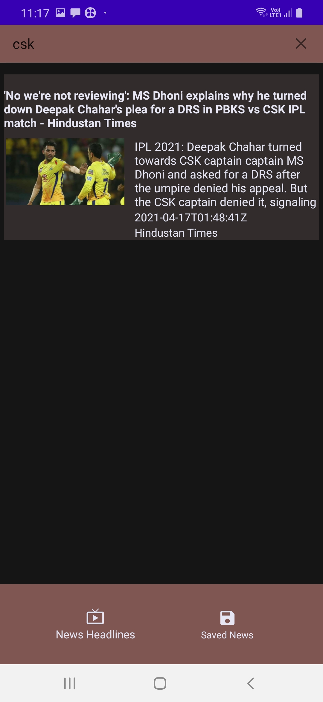

# News_Android_Application
## Description

We always wants to know what is happening around us. Thus we refer to news. But severall news application provides us with the news they would like to offer. So keeping this in mind, I have created an Android application which allows us to search news based on the query we request. We can also bookmark the news in our local database for further view. Similarly we can also delete the saved news as we please.

## Application Screenshots

      

## Usage

For installation and usage of this application
Navigate to: [/APK/NewsApp.apk](https://github.com/SayantanBanerjee16/NewsApp/tree/main/APK) download and install the application into your android phones. <Recommended Android 8.0(Oreo) version and above>

## Demo Video

* <a href="https://drive.google.com/file/d/1womu1J199gG6loW3xmcKVTq6kd2Dupbj/view?usp=sharing"> **Video presentation post** </a>

## Code structure

This application is created mainly by keeping Clean Code MVVM Architecture into our point of vision. 

Why the cleaner approach?

- Separation of code in different layers with assigned responsibilities making it easier for further modification.
- High level of abstraction
- Loose coupling between the code
- Testing of code is painless

What are the Different Layers of the Project?

- **Data layer:** Would dispense the required data for the application to the domain layer by implementing interface exposed by the domain.
  - **Remote Database:** API provides remote networking implementation. Any networking library can be integrated into Android Application using Retrofit. Defining the interfaces and setting up the RetrofitService is done in this layer.
  - **Local Database:** The Room persistence library provides an abstraction layer over SQLite to allow fluent database access while harnessing the full power of SQLite. Defining the Room entity, setting up the DAO Interface and building the Database Builder is done in this layer.

- **Domain layer:** This will be the most generic layer of the three. It will connect the presentation layer with the data layer. This is the layer where app-related business logic will be executed. All the application use-cases and the repositories interfaces reside in the domain layer.
  - **Use Cases:** Use cases are the application logic executor. As the name depicts each functionality can have its separate use case. With more granularity of the use case creation, it can be reused more often.
  - **Repositories:** It specifies the functionalities required by the use cases which is implemented by the data layer. 

- **Presentation layer:** The presentation layer provides the UI implementation of the application. This layer internally implements MVVM (Model-View-ViewModel) architecture.
  - Why _MVVM Architecture_ over other patterns: MVVM architecture is a Model-View-ViewModel architecture that removes the tight coupling between each component. Most importantly, in this architecture, the children don't have the direct reference to the parent, they only have the reference by observables. Also View Model store and manage UI-related data in a lifecycle conscious way. It allows data to survive configuration changes such as screen rotations.

## Technologies

- [Kotlin](https://kotlinlang.org/) - Official programming language for Android development.
- [Coroutines](https://kotlinlang.org/docs/reference/coroutines-overview.html) - For working with asynchronous threading related task.
- [Flow](https://kotlin.github.io/kotlinx.coroutines/kotlinx-coroutines-core/kotlinx.coroutines.flow/-flow/) - A cold asynchronous data stream that sequentially emits values and completes normally or with an exception.
- [Android Architecture Components](https://developer.android.com/topic/libraries/architecture) - Collection of libraries that help you design robust, testable, and maintainable apps. Thus they help us to separate business logic apart from the UI logic and helps us in designing proper architecture.
  - [LiveData](https://developer.android.com/topic/libraries/architecture/livedata) - Data objects that notify views when the underlying database changes.
  - [ViewModel](https://developer.android.com/topic/libraries/architecture/viewmodel) - Stores UI-related data that isn't destroyed on configuration changes. 
  - [ViewBinding](https://developer.android.com/topic/libraries/view-binding) - View binding is a feature that allows you to more easily write code that interacts with views.
  - [Room](https://developer.android.com/topic/libraries/architecture/room) - The Room persistence library provides an abstraction layer over SQLite to allow fluent database access while harnessing the full power of SQLite.
- [Dependency Injection](https://developer.android.com/training/dependency-injection) - 
  - [Hilt](https://developer.android.com/training/dependency-injection/hilt-android) - Hilt is a dependency injection library for Android that reduces the boilerplate of doing manual dependency injection in your project. 
- [Retrofit](https://square.github.io/retrofit/) - A type-safe HTTP client for Android and Java.
- [Glide](https://github.com/bumptech/glide) - Glide is a fast and efficient open source media management and image loading framework for Android.

## Built With

* Android Studio
* [NEWS API](https://newsapi.org/)

## Author

* <a href="https://www.linkedin.com/in/sayantan-banerjee-iiitgwalior/">  **Sayantan Banerjee** </a>
